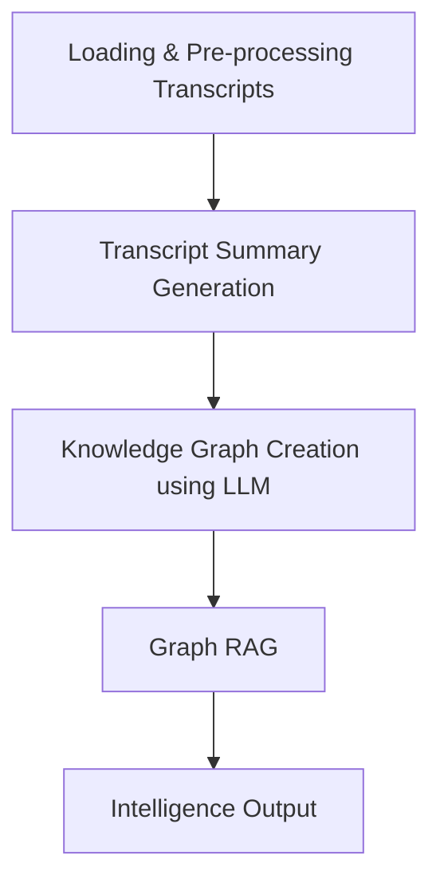

# Neo4j Knowledge Graph Synthesis RAG App for Law Enforcement of Organized Criminal Network
!!!Making one for the law Enforcement &amp; Government

(Following Works in progress)
- Deployment
- Modules in python


This solution implements a sophisticated graph system for analyzing and processing law enforcement transcripts using Large Language Models (LLMs), Retrieval-Augmented Generation (RAG), and Neo4j Knowledge Graphs. The system is designed to help law enforcement agencies better understand and analyze criminal networks and organizations.

## Project Overview

The system processes law enforcement transcripts through several key stages:
1. Transcript loading and processing
2. Summary generation using LLMs
3. Knowledge graph construction in Neo4j
4. RAG-based query answering system


# Process Flow



## Project Structure

```
.
├── app.py                  # Main application entry point
├── config.py              # Configuration settings
├── generate_summary.py    # Transcript summary generation
├── graph_rag.py          # RAG implementation with Neo4j
├── knowledge_graph.py    # Neo4j knowledge graph operations
├── load_transcript.py    # Transcript loading and processing
├── llm.py                # LLM-related functionality
├── requirements.txt      # Project dependencies
└── call_transcripts/     # Directory containing law enforcement transcripts
```

## Dependencies

The project uses several key technologies and libraries:
- Python 3.x
- Neo4j Desktop
- LangChain
- OpenAI API
- Gemini API
- Various Python packages (see requirements.txt)

## Installation

1. Clone the repository
2. Create a virtual Python environment (Avoids interference with global packages):
   ```bash
   python -m venv .venv
   source .venv/bin/activate  # On Windows: .venv\Scripts\activate
   ```

3. Install dependencies:
   ```bash
   pip install -r requirements.txt
   ```
4. Set up your environment variables in `config.py`

## Usage

1. Ensure Neo4j database is running and accessible
   
   To run the knowledge graph locally using Neo4j with Bolt protocol, follow these steps:

   1. Install Neo4j Desktop from https://neo4j.com/download

   2. Create a new project and start a database

   3. Set the Bolt connection credentials:
      1. URL: bolt://localhost:7687
      2. Username: neo4j
      3. Password: your-password (update in config.py)
   
3. Run the main application:
   ```bash
   python app.py
   ```
4. Enter your query when prompted

## Configuration

Update the following in `config.py`:
- Neo4j connection details
- API keys for LLM services
- Other configuration parameters


## Contributing

Contributions are welcome! Please feel free to submit a Pull Request.

## Acknowledgments

- Call transcripts generated from LLM - Google Studio
- Open source community for various tools and libraries
- Research papers and resources referenced in References.txt 
