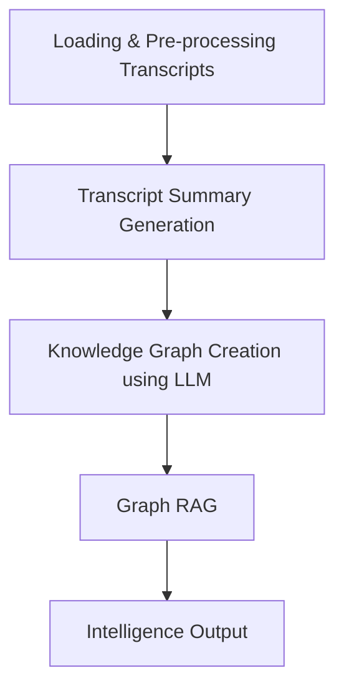

# Neo4j-Knowledge-Graph-Synthesis-RAG-App-for-Law-Enforcement-of-Organized-Criminal-Network
Making one for the law Enforcement &amp; Government

# LLM - RAG - Neo4j Knowledge Graph for Law Enforcement

This solution implements a sophisticated graph system for analyzing and processing law enforcement transcripts using Large Language Models (LLMs), Retrieval-Augmented Generation (RAG), and Neo4j Knowledge Graphs. The system is designed to help law enforcement agencies better understand and analyze criminal networks and organizations.

## Project Overview

The system processes law enforcement transcripts through several key stages:
1. Transcript loading and processing
2. Summary generation using LLMs
3. Knowledge graph construction in Neo4j
4. RAG-based query answering system


# Process Flow




## Features

- **Transcript Processing**: Load and process law enforcement transcripts
- **Summary Generation**: Generate comprehensive summaries of transcripts using LLMs
- **Knowledge Graph**: Build and maintain a Neo4j knowledge graph of entities and relationships
- **RAG System**: Implement a retrieval-augmented generation system for answering queries
- **Query Interface**: Natural language query processing and response generation

## Project Structure

```
.
├── app.py                  # Main application entry point
├── config.py              # Configuration settings
├── generate_summary.py    # Transcript summary generation
├── graph_rag.py          # RAG implementation with Neo4j
├── knowledge_graph.py    # Neo4j knowledge graph operations
├── load_transcript.py    # Transcript loading and processing
├── llm.py                # LLM-related functionality
├── requirements.txt      # Project dependencies
└── call_transcripts/     # Directory containing law enforcement transcripts
```

## Dependencies

The project uses several key technologies and libraries:
- Python 3.x
- Neo4j Database
- LangChain
- OpenAI API
- Google AI Generative Language
- Various Python packages (see requirements.txt)

## Installation

1. Clone the repository
2. Create a virtual Python environment (Avoids interference with global packages):
   ```bash
   python -m venv .venv
   source .venv/bin/activate  # On Windows: .venv\Scripts\activate
   ```

3. Install dependencies:
   ```bash
   pip install -r requirements.txt
   ```
4. Set up your environment variables in `config.py`

## Usage

1. Ensure Neo4j database is running and accessible
2. Run the main application:
   ```bash
   python app.py
   ```
3. Enter your query when prompted

## Configuration

Update the following in `config.py`:
- Neo4j connection details
- API keys for LLM services
- Other configuration parameters

## Contributing

Contributions are welcome! Please feel free to submit a Pull Request.

## License

[Specify your license here]

## Acknowledgments

- Law enforcement agencies for providing transcripts
- Open source community for various tools and libraries
- Research papers and resources referenced in References.txt 
